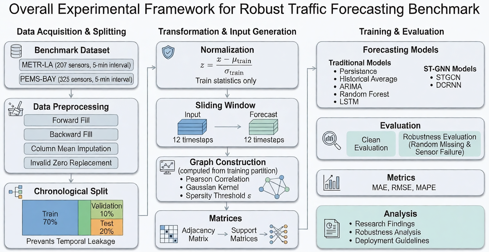
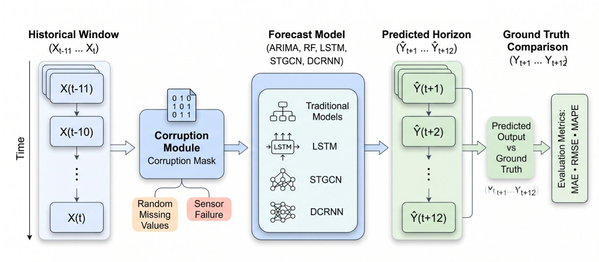
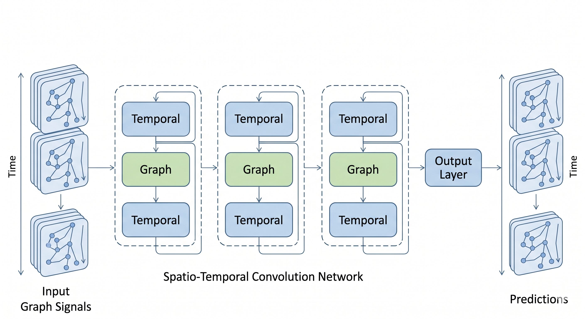
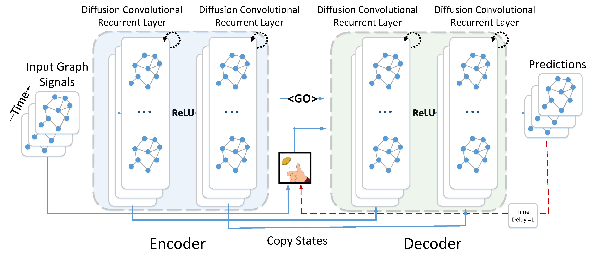
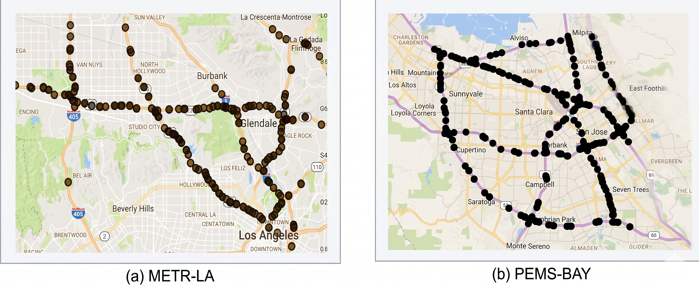

<div align="center">

# Robustness in Spatio-Temporal GNN Traffic Forecasting

**A Robustness-Oriented Comparative Study of Traditional and Graph Neural Network Models for Traffic Speed Forecasting Under Realistic Sensor Degradation**

[](https://python.org)
[](https://pytorch.org)
[](LICENSE)
[]()

*Evaluating whether state-of-the-art accuracy on clean benchmarks translates to reliable performance when sensors fail.*

---

[Key Findings](#-key-findings) · [Architecture](#-model-architectures) · [Datasets](#-datasets) · [Quick Start](#-quick-start) · [Results](#-results) · [Citation](#-citation)

</div>

---

## Abstract

Short-term traffic forecasting is essential for intelligent transportation systems — powering navigation, adaptive signal control, emergency response, and congestion management. Recent **Spatio-Temporal Graph Neural Networks (ST-GNNs)** such as DCRNN and STGCN achieve impressive accuracy on clean benchmark data by jointly modeling spatial and temporal dependencies. But **does high accuracy on clean data guarantee reliable performance when real sensors fail?**

This study presents a **robustness-oriented benchmark** comparing **seven forecasting models** across two public datasets under controlled sensor degradation. The results reveal a fundamental **accuracy–robustness trade-off**: the most accurate model under clean conditions is often the least reliable under corruption.

<div align="center">



*Fig. 1 — Overall experimental framework: data acquisition, preprocessing with leakage prevention, graph construction, model training, and robustness evaluation under random missing values and structured sensor failures.*

</div>

---

## Research Contributions

1. **Robustness benchmark** for seven forecasting models (Persistence, Historical Average, ARIMA, Random Forest, LSTM, STGCN, DCRNN) across two public datasets
2. **Dual corruption evaluation** comparing random missing values and structured sensor failures — demonstrating that robustness is not a single-dimensional property
3. **Graph topology ablation** revealing that learned graph structure contributes only marginal accuracy gains, suggesting temporal learning dominates
4. **Deployment-oriented evaluation** beyond clean-data accuracy — showing that the most accurate model (DCRNN) is the least robust under corruption

---

##  Key Findings

### Finding 1: Clean Accuracy ≠ Deployment Robustness

<table>
<tr><th>Rank</th><th>Model</th><th>METR-LA MAE</th><th>PEMS-BAY MAE</th><th>Type</th></tr>
<tr><td>🥇</td><td><b>DCRNN</b></td><td><b>3.548</b></td><td><b>1.905</b></td><td>Graph Neural Network</td></tr>
<tr><td>🥈</td><td>STGCN</td><td>3.634</td><td>2.299</td><td>Graph Neural Network</td></tr>
<tr><td>🥉</td><td>LSTM</td><td>3.707</td><td>2.071</td><td>Deep Learning</td></tr>
<tr><td>4</td><td>Random Forest</td><td>3.758</td><td>2.113</td><td>Traditional ML</td></tr>
<tr><td>5</td><td>Persistence</td><td>3.856</td><td>2.170</td><td>Baseline</td></tr>
<tr><td>6</td><td>ARIMA(2,1,2)</td><td>3.990</td><td>2.294</td><td>Classical</td></tr>
<tr><td>7</td><td>Historical Avg.</td><td>5.120</td><td>3.559</td><td>Baseline</td></tr>
</table>

### Finding 2: STGCN Is the Most Robust GNN Under Random Missing Data

| Model | Clean MAE | 40% Corrupted MAE | Degradation | Insight |
|---|---|---|---|---|
| **STGCN** | 3.634 | 4.615 ± 0.004 | **+27.0%** | ✅ Most robust — spectral smoothing absorbs scattered noise |
| Persistence | 3.856 | 4.970 ± 0.003 | +28.9% | Naive copy degrades predictably |
| Random Forest | 3.758 | 4.898 ± 0.002 | +30.3% | Feature-based, no spatial structure |
| LSTM | 3.707 | 4.885 ± 0.001 | +31.8% | Temporal gating partially compensates |
| **DCRNN** | 3.548 | 4.772 ± 0.004 | **+34.5%** | ⚠️ Least robust — autoregressive decoder amplifies corruption |

### Finding 3: The Robustness Ranking Reverses Under Sensor Failure

> **Critical insight:** Under complete sensor failure, graph message passing becomes a *liability*. Failed sensor zeros propagate through spatial convolutions to corrupt neighboring node representations.

| Model | Random Missing Rank | Sensor Failure Rank | Change | Why? |
|---|---|---|---|---|
| **STGCN** | 2nd (+27.0%) | 6th (+34.9%) | **↓ 4** | Spectral conv amplifies concentrated corruption |
| LSTM | 5th (+31.8%) | 4th (+31.1%) | ↑ 1 | No spatial edges → no corruption propagation |
| DCRNN | 6th (+34.5%) | 5th (+33.0%) | ↑ 1 | Diffusion conv propagates less than spectral |

### Finding 4: Learned Graph Topology Provides Only Marginal Benefit

The correlation-based graph improves DCRNN by only **1.92%** and STGCN by **0.95%** over identity graphs (no spatial edges). This suggests temporal learning dominates under the tested configuration.

---

## Problem Formulation

<div align="center">



*Fig. 2 — Robustness evaluation protocol: 12-step historical input passes through a corruption module (random missing or sensor failure), then through each forecasting model, and predictions are compared against clean ground truth using MAE, RMSE, and MAPE.*

</div>

**Input:** 12 timesteps of traffic speed (60 min) across N sensors on a road graph  
**Output:** 12 timesteps of future traffic speed (60 min)  
**Corruption:** Binary mask M applied to input — target output always remains clean  
**Evaluation:** How much does each model degrade as corruption ratio p increases from 0% to 40%?

---

##  Model Architectures

This benchmark evaluates **seven models** spanning four paradigm families:

### Spatio-Temporal Graph Neural Networks

<table>
<tr>
<td width="50%" align="center">



**STGCN** — Spatio-Temporal Graph Convolutional Network

</td>
<td width="50%" align="center">



**DCRNN** — Diffusion Convolutional Recurrent Neural Network

</td>
</tr>
<tr>
<td>

- Chebyshev spectral graph convolution (K=3)
- Gated temporal CNN with GLU activation
- **Parallel** output: all 12 horizons at once
- *Why robust to random noise:* spectral filtering acts as a spatial low-pass filter

</td>
<td>

- Bidirectional diffusion convolution (K=2)
- DCGRU encoder-decoder with teacher forcing
- **Sequential** output: horizon-by-horizon
- *Why sensitive to corruption:* autoregressive chain amplifies encoder errors

</td>
</tr>
</table>

### Complete Model Comparison

| Model | Spatial Learning | Temporal Learning | Parameters |
|---|---|---|---|
| Persistence | — | Copy last value | 0 |
| Historical Average | — | Time-of-day lookup | 0 |
| ARIMA(2,1,2) | — | Per-sensor ARIMA | N/A |
| Random Forest | Implicit (flattened input) | 100 trees, max depth 15 | ~450K |
| LSTM | Implicit | 2-layer, hidden dim 64 | ~55K |
| **STGCN** | Chebyshev spectral conv (K=3) | Gated 1D CNN | ~80K |
| **DCRNN** | Bidirectional diffusion conv (K=2) | DCGRU seq2seq | ~223K |

---

## 🗺️ Datasets

<div align="center">



*Fig. 3 — Sensor locations: (a) METR-LA — 207 loop detectors on Los Angeles highways; (b) PEMS-BAY — 325 detectors in the San Francisco Bay Area.*

</div>

| Property | METR-LA | PEMS-BAY |
|---|---|---|
| **Location** | Los Angeles, CA | San Francisco Bay Area, CA |
| **Sensors** | 207 | 325 |
| **Timesteps** | 34,272 | 52,116 |
| **Duration** | Mar – Jun 2012 (4 months) | Jan – Jun 2017 (6 months) |
| **Interval** | 5 minutes | 5 minutes |
| **Feature** | Speed (mph) | Speed (mph) |
| **Train / Val / Test** | 70% / 10% / 20% | 70% / 10% / 20% |
| **Adjacency size** | 207 × 207 | 325 × 325 |
| **Avg. connections/node** | 2.2 | 7.6 |
| **Sparsity** | 98.96% | 97.67% |

---

## Results

### Clean-Data Performance (Per-Horizon MAE in mph)

<details>
<summary><b>METR-LA</b> — Click to expand</summary>

| Model | 15 min | 30 min | 60 min | Overall |
|---|---|---|---|---|
| **DCRNN** | **2.868** | **3.540** | 4.541 | **3.548** |
| STGCN | 3.214 | 3.605 | **4.242** | 3.634 |
| LSTM | 2.988 | 3.685 | 4.759 | 3.707 |
| Random Forest | 3.049 | 3.753 | 4.798 | 3.758 |
| Persistence | 3.161 | 3.831 | 4.905 | 3.856 |
| ARIMA | 3.324 | 3.947 | 5.009 | 3.990 |
| Hist. Average | 5.120 | 5.120 | 5.120 | 5.120 |

> 📌 STGCN surpasses DCRNN at 60-min horizon (4.242 vs 4.541) — parallel decoding avoids autoregressive error compounding.

</details>

<details>
<summary><b>PEMS-BAY</b> — Click to expand</summary>

| Model | 15 min | 30 min | 60 min | Overall |
|---|---|---|---|---|
| **DCRNN** | **1.472** | **1.942** | **2.519** | **1.905** |
| LSTM | 1.523 | 2.083 | 2.864 | 2.071 |
| Random Forest | 1.553 | 2.135 | 2.920 | 2.113 |
| Persistence | 1.591 | 2.171 | 3.039 | 2.170 |
| ARIMA | 1.747 | 2.292 | 3.119 | 2.294 |
| STGCN | 2.077 | 2.302 | 2.604 | 2.299 |
| Hist. Average | 3.559 | 3.559 | 3.559 | 3.559 |

> 📌 STGCN ranks below LSTM and RF on PEMS-BAY — the denser graph (7.6 conn/node) may cause over-smoothing with K=3 Chebyshev.

</details>

### Robustness Under Corruption

<div align="center">


*Fig. 4 — Model robustness under increasing corruption on METR-LA. Left: random missing values (scattered). Right: structured sensor failure (entire sensors zeroed). Note the ±1σ bands — sensor failure produces dramatically higher variance, indicating sensitivity to which specific sensors fail.*

</div>

### Graph Structure Ablation

| Model | Graph Type | Overall MAE | RMSE | Δ MAE vs. Learned |
|---|---|---|---|---|
| DCRNN | Learned | 3.548 | 6.672 | — |
| DCRNN | Identity (no edges) | 3.616 | 7.012 | +1.92% |
| DCRNN | Random | 3.532 | 6.584 | −0.45% |
| STGCN | Learned | 3.634 | 6.291 | — |
| STGCN | Identity (no edges) | 3.669 | — | +0.95% |
| STGCN | Random | 3.630 | — | −0.11% |

>  Differences within 2% across all graph types — temporal modules (DCGRU, gated CNN) capture the majority of the predictive signal.

---

## Quick Start

### Prerequisites

- **Python** 3.10+
- **NVIDIA GPU** with CUDA (RTX 3060+ recommended)
- **RAM** 16 GB minimum

>  For detailed environment setup (Windows/Linux, CUDA installation, troubleshooting), see **[SETUP.md](SETUP.md)**.

### Installation

```bash
# Clone the repository
git clone https://github.com/kasim672/robustness-in-spatio-temporal-gnn-traffic-forecasting.git
cd robustness-in-spatio-temporal-gnn-traffic-forecasting

# Create virtual environment
python3 -m venv venv
source venv/bin/activate        # Linux / macOS
# venv\Scripts\activate          # Windows

# Install dependencies
pip install -r requirements.txt
```

### Training

>  For complete step-by-step training instructions, see **[installation.md](installation.md)**.

```bash
# ── Phase 1: METR-LA ──────────────────────────────────
python -u run_gnn.py --dataset METR-LA --model dcrnn
python -u run_gnn.py --dataset METR-LA --model stgcn
python -u run_baselines.py --dataset METR-LA

# ── Phase 2: PEMS-BAY ─────────────────────────────────
python -u run_gnn.py --dataset PEMS-BAY --model dcrnn
python -u run_gnn.py --dataset PEMS-BAY --model stgcn
python -u run_baselines.py --dataset PEMS-BAY
```

### Evaluation & Paper Assets

```bash
# Robustness evaluation (5 corruption seeds per ratio)
python -u run_robustness.py --dataset METR-LA --n-seeds 5
python -u run_robustness.py --dataset PEMS-BAY --n-seeds 5

# Graph analysis
python -u run_sparsity_analysis.py

# Generate plots and LaTeX tables
python plot_robustness.py
python generate_paper_assets.py

# Validate pipeline integrity
python validate.py --dataset METR-LA
python validate.py --dataset PEMS-BAY
```

---

## Ablation Studies

### Graph Structure Ablation

Tests whether the learned graph topology is actually beneficial, or if GNNs succeed primarily through temporal learning.

```bash
# Identity graph — no spatial edges (each sensor isolated)
python -u run_gnn.py --dataset METR-LA --ablation identity --model stgcn
python -u run_gnn.py --dataset METR-LA --ablation identity --model dcrnn

# Random graph — same density, random edges
python -u run_gnn.py --dataset METR-LA --ablation random --model stgcn
python -u run_gnn.py --dataset METR-LA --ablation random --model dcrnn
```

> Ablation checkpoints save to separate files (e.g., `stgcn_METR-LA_ablation_identity_best.pt`) and **never overwrite** production models.

---

##  Project Structure

```
GraphNN/
├── src/                              # Core library
│   ├── config.py                     # Hyperparameters, paths, reproducibility
│   ├── data_loader.py                # CSV loading, normalization, sequence creation
│   ├── graph_builder.py              # Correlation-based adjacency, Chebyshev, diffusion
│   ├── evaluate.py                   # MAE, RMSE, MAPE at 15/30/60 min horizons
│   ├── train.py                      # Training loop (AMP, early stopping, LR schedule)
│   ├── robustness.py                 # Corruption injection (random missing, sensor failure)
│   ├── visualize.py                  # Plotting utilities
│   └── models/
│       ├── sanity_baselines.py       # Persistence, Historical Average
│       ├── arima_model.py            # ARIMA(2,1,2) per sensor
│       ├── rf_model.py               # Random Forest (100 trees)
│       ├── lstm_model.py             # 2-layer LSTM (hidden 64)
│       ├── stgcn.py                  # Chebyshev graph conv + gated temporal CNN
│       └── dcrnn.py                  # Diffusion conv + DCGRU encoder-decoder
├── assets/                           # Paper figures and architecture diagrams
│   ├── pipeline.png                  # Experimental framework overview
│   ├── dataset.png                   # Sensor network maps
│   ├── stgcn.png                     # STGCN architecture diagram
│   ├── dcrnn.jpg                     # DCRNN architecture diagram
│   └── problemFormulation.jpeg       # Robustness evaluation protocol
├── dataset/
│   ├── METR-LA.csv                   # 207 sensors × 34,272 timesteps
│   └── PEMS-BAY.csv                  # 325 sensors × 52,116 timesteps
├── results/
│   ├── metrics/                      # JSON results (committed)
│   ├── plots/                        # Generated figures (committed)
│   ├── models/                       # Checkpoints (.gitignored)
│   └── paper_assets/                 # LaTeX tables, CSV summaries
├── run_baselines.py                  # Train all baseline models
├── run_gnn.py                        # Train STGCN / DCRNN (+ ablation support)
├── run_robustness.py                 # Multi-seed robustness evaluation
├── run_sparsity_analysis.py          # Graph spectral analysis
├── plot_robustness.py                # Robustness curves with ±1σ bands
├── generate_paper_assets.py          # LaTeX tables + CSV summaries
├── validate.py                       # Full pipeline sanity check

├── installation.md                   # Step-by-step training instructions
├── SETUP.md                          # Environment setup guide
└── requirements.txt                  # Python dependencies
```

---

## Experimental Protocol

All experiments follow a rigorous evaluation methodology to ensure fair comparison and prevent information leakage:

- **Chronological data splits** — 70% train / 10% validation / 20% test, preserving temporal order
- **Train-only normalization** — Z-score statistics (μ, σ) computed exclusively from the training partition
- **Train-only graph construction** — adjacency matrix built from training data only; no test information leaks into spatial structure
- **Boundary-aware sequences** — sliding windows never cross train/val/test partition boundaries
- **De-normalized evaluation** — all metrics (MAE, RMSE, MAPE) computed in original speed units (mph)
- **Uniform evaluation** — all seven models share identical data splits, prediction horizons, and evaluation metrics
- **Five-seed robustness evaluation** — corruption injected with seeds [0–4]; results reported as mean ± standard deviation

---

## Reproducibility

```python
# All scripts use:
set_seed(42)  # Fixed in src/config.py

# Robustness variance is over corruption realizations, not model weights
# Seeds [0..4] for corruption injection → reports mean ± std
```

All metrics (`.json`) and plots (`.png`) are committed to git.  
Model weights are `.gitignored` (too large) — reproduce by following the [training guide](installation.md).

---
## Citation

If you use this benchmark in your research:

```bibtex
@misc{graphnn2026,
  title   = {Robustness in Spatio-Temporal GNN Traffic Forecasting},
  author  = {Ghanchi, Kasim Ishaque and Mirza, Ali Mehdi and Desai, Shreya},
  year    = {2026},
  url     = {https://github.com/kasim672/robustness-in-spatio-temporal-gnn-traffic-forecasting}
}
```

---

## 📚 References

For the complete bibliography (24 references), please refer to the accompanying research paper.

---

## License

This project is for **academic research purposes**.

---

<div align="center">


**Kasim Ishaque Ghanchi · Ali Mehdi Mirza · Shreya Desai**

</div>
